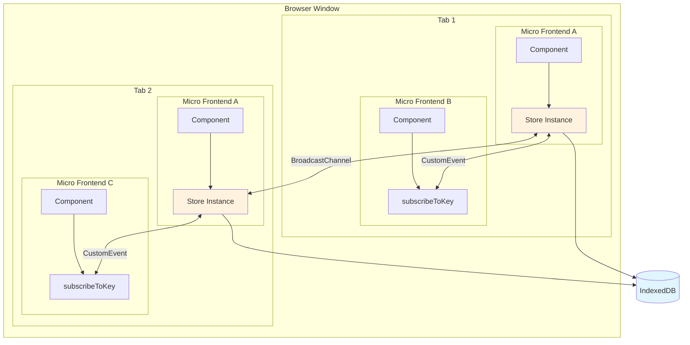
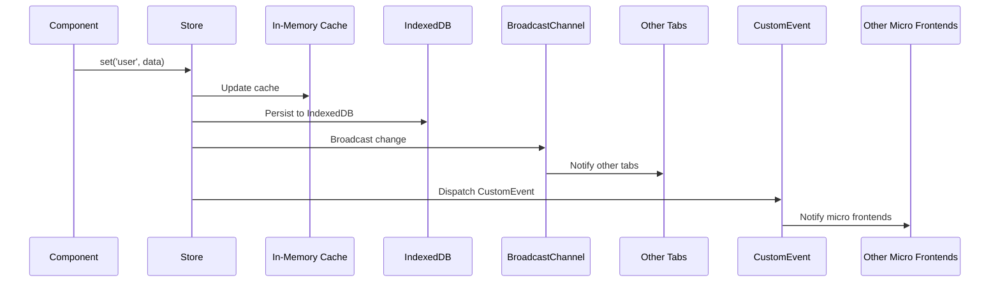

# mfe-store

A lightweight, framework-agnostic state store designed for micro frontend architectures. Uses IndexedDB for persistence and native browser APIs for pub/sub communication.

## Features

- **Zero dependencies** - Uses only native browser APIs
- **Framework agnostic** - Works with React, Vue, Svelte, vanilla JS, or any framework
- **Micro frontend friendly** - Independent sites can subscribe without sharing code
- **Persistent** - Data survives browser restarts via IndexedDB
- **Cross-tab sync** - Changes propagate to all tabs automatically
- **Schema validation** - Optional validators to enforce data integrity
- **Type-safe** - Full TypeScript support with generics
- **Tiny** - ~2KB minified

## Architecture



### Data Flow



### Layer Responsibilities

| Layer | Technology | Purpose |
|-------|------------|---------|
| **Persistence** | IndexedDB | Durable storage that survives browser restarts |
| **Cross-Tab Sync** | BroadcastChannel | Real-time sync between browser tabs |
| **In-Page Pub/Sub** | CustomEvent | Communication between micro frontends on same page |
| **Caching** | In-Memory Map | Fast synchronous reads after initial load |

## Installation

```bash
npm install mfe-store
```

## Quick Start

### Basic Usage

```typescript
import { createStore } from 'mfe-store';

// Define your state shape
interface AppState {
  user: { id: string; name: string } | null;
  theme: 'light' | 'dark';
  cart: string[];
}

// Create the store
const store = createStore<AppState>({
  dbName: 'my-app',
});

// Set values
await store.set('user', { id: '1', name: 'Alice' });
await store.set('theme', 'dark');

// Get values
const user = await store.get('user');
const theme = await store.get('theme');

// Subscribe to changes
const unsubscribe = store.subscribe('user', (newValue, oldValue) => {
  console.log('User changed:', oldValue, '->', newValue);
});

// Later: unsubscribe
unsubscribe();
```

### Micro Frontend Integration

The key benefit for micro frontends is that independent applications can subscribe to state changes without importing the store directly.

**Main App (owns the store):**

```typescript
import { createStore } from 'mfe-store';

export const store = createStore<AppState>({
  dbName: 'shared-state',
  channelName: 'my-app-channel',
});
```

**Micro Frontend (subscribes without store reference):**

```typescript
import { subscribeToKey } from 'mfe-store';

// Subscribe using only the channel name - no store import needed
const unsubscribe = subscribeToKey<User>(
  'my-app-channel',  // Same channel name
  'user',            // Key to watch
  (user, oldUser) => {
    console.log('User updated:', user);
    renderUserWidget(user);
  }
);
```

### React Integration

React bindings are available via a separate import to keep the core bundle small for vanilla JS users.

```typescript
import { createStore } from 'mfe-store';
import { createStoreHooks } from 'mfe-store/react';

// Create store
const store = createStore<AppState>({ dbName: 'my-app' });

// Create typed hooks
const { useValue, useValueSync, useAll } = createStoreHooks(store);

// Use in components
function UserProfile() {
  const [user, setUser, loading] = useValue('user');

  if (loading) return <div>Loading...</div>;
  if (!user) return <div>Not logged in</div>;

  return (
    <div>
      <h1>{user.name}</h1>
      <button onClick={() => setUser({ ...user, name: 'Bob' })}>
        Change Name
      </button>
    </div>
  );
}
```

### Vanilla JavaScript

```javascript
import { createStore } from 'mfe-store';

const store = createStore({ dbName: 'my-app' });

// Subscribe and update DOM
store.subscribe('count', (count) => {
  document.getElementById('counter').textContent = count;
});

// Button handler
document.getElementById('increment').onclick = async () => {
  const current = await store.get('count') ?? 0;
  await store.set('count', current + 1);
};
```

### Schema Validation

Add optional validators to enforce data integrity. Validators are functions that throw an error to reject invalid values.

**Vanilla JavaScript:**

```javascript
import { createStore } from 'mfe-store';

const store = createStore({
  dbName: 'my-app',
  validators: {
    username: (value) => {
      if (typeof value !== 'string') {
        throw new Error('username must be a string');
      }
      if (value.length < 2) {
        throw new Error('username must be at least 2 characters');
      }
    },
    age: (value) => {
      if (typeof value !== 'number') {
        throw new Error('age must be a number');
      }
      if (value < 0 || value > 150) {
        throw new Error('age must be between 0 and 150');
      }
    }
  }
});

// Valid - works
await store.set('username', 'Alice');
await store.set('age', 30);

// Invalid - throws Error
try {
  await store.set('username', 12345);
} catch (err) {
  console.error(err.message); // "username must be a string"
}
```

**With Zod (bring your own validation library):**

```typescript
import { createStore } from 'mfe-store';
import { z } from 'zod';

const UserSchema = z.object({
  id: z.string(),
  name: z.string().min(2),
  email: z.string().email(),
});

const store = createStore({
  dbName: 'my-app',
  validators: {
    user: (value) => UserSchema.parse(value),
  }
});
```

**With Valibot (smaller alternative):**

```typescript
import { createStore } from 'mfe-store';
import * as v from 'valibot';

const UserSchema = v.object({
  id: v.string(),
  name: v.pipe(v.string(), v.minLength(2)),
  email: v.pipe(v.string(), v.email()),
});

const store = createStore({
  dbName: 'my-app',
  validators: {
    user: (value) => v.parse(UserSchema, value),
  }
});
```

## API Reference

### `createStore<T>(options?)`

Creates a new store instance.

**Options:**

| Option | Type | Default | Description |
|--------|------|---------|-------------|
| `dbName` | `string` | `'mfe-store'` | IndexedDB database name |
| `storeName` | `string` | `'store'` | Object store name within the database |
| `channelName` | `string` | `dbName` | BroadcastChannel name for cross-tab sync |
| `validators` | `{ [key]: (value) => void }` | `undefined` | Validation functions per key (throw to reject) |

**Returns:** `Store<T>`

### Store Methods

| Method | Signature | Description |
|--------|-----------|-------------|
| `get` | `(key: K) => Promise<T[K] \| undefined>` | Get a value by key |
| `set` | `(key: K, value: T[K]) => Promise<void>` | Set a value |
| `delete` | `(key: K) => Promise<void>` | Delete a key |
| `subscribe` | `(key: K, listener) => Unsubscribe` | Subscribe to changes |
| `getAll` | `() => Promise<Partial<T>>` | Get all stored values |
| `clear` | `() => Promise<void>` | Clear all data |
| `destroy` | `() => void` | Close connections and cleanup |

### `subscribeToKey<T>(channelName, key, listener)`

Subscribe to a key without a store reference. Useful for micro frontends.

```typescript
const unsubscribe = subscribeToKey<User>(
  'my-app-channel',
  'user',
  (value, oldValue) => { /* handle change */ }
);
```

## Browser Support

Requires browsers with support for:

- IndexedDB
- BroadcastChannel
- CustomEvent

This includes all modern browsers (Chrome, Firefox, Safari, Edge). No IE11 support.

## How It Works

1. **Write Path**: When you call `set()`, the store:
   - Updates the in-memory cache (instant)
   - Persists to IndexedDB (async)
   - Dispatches a CustomEvent (in-page micro frontends)
   - Posts to BroadcastChannel (other tabs)

2. **Read Path**: When you call `get()`, the store:
   - Returns from cache if available (sync-fast)
   - Falls back to IndexedDB if not cached

3. **Cross-Tab**: BroadcastChannel ensures all tabs see the same state. Each tab maintains its own cache, synchronized via broadcast messages.

4. **Micro Frontends**: CustomEvents on `window` allow independent applications to subscribe without sharing module scope. They only need to know the channel name.

## Development

### Project Structure

```
mfe-store/
├── src/                    # Library source
│   ├── store.ts            # Core store implementation
│   ├── react.ts            # React bindings (optional)
│   └── index.ts            # Main exports
├── test-app/               # Integration test app
│   ├── src/sites/
│   │   ├── site-a/         # Publisher micro site (vanilla JS)
│   │   ├── site-b/         # Subscriber micro site (vanilla JS)
│   │   ├── site-validation/# Validation test site (vanilla JS)
│   │   └── site-react/     # React integration test site
│   ├── tests/              # Playwright tests
│   ├── index.html          # Pub/sub demo (vanilla JS)
│   ├── validation.html     # Validation demo
│   ├── react.html          # React demo
│   └── package.json
├── scripts/
│   └── publish-local.sh    # Publish to local Verdaccio
├── docker-compose.yml      # Verdaccio container
└── package.json
```

### Testing with Verdaccio

The test-app consumes the package from a local npm registry (Verdaccio) to validate the real publish/install flow.

```bash
# 1. Start Verdaccio (requires Docker)
docker compose up -d

# 2. Build, publish to Verdaccio, and install in test-app
npm run test:pub

# 3. Run Playwright tests
cd test-app && npm test
```

### Test Coverage

The Playwright tests verify:

**Vanilla JS (pub/sub):**
- Site A publishes → Site B receives via CustomEvent
- Multiple updates received in order
- Delete/Clear notifies subscribers
- Data persists after page reload

**Schema Validation:**
- Accepts valid values
- Rejects invalid types (e.g., number instead of string)
- Rejects values failing custom rules (e.g., string too short)

**React Integration:**
- `useValue` hook loads and displays state
- State updates trigger re-renders
- Validation errors are catchable
- State persists after reload

## License

MIT
